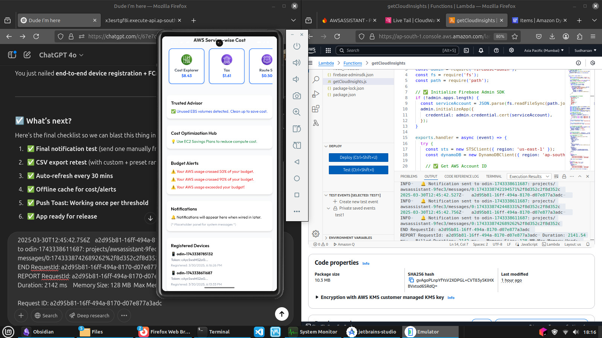
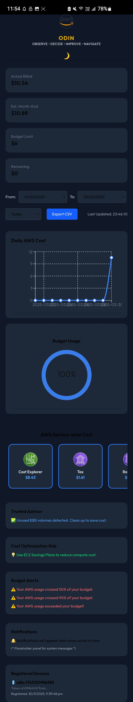

# ⚡ ODIN — AWS Cost Intelligence & Optimization Dashboard

> OBSERVE • DECIDE • IMPROVE • NAVIGATE  
> **Your AWS budget guardian — in your hand, anytime, anywhere.**

ODIN is a mobile-first, production-ready FinOps dashboard that gives you **real-time AWS cost visibility**, **push alerts**, **budget tracking**, and **optimization insights** — with **zero Cost Explorer charges**.

---

### 🔗 Live Web Console  
🌐 [aws.sudharsan17.online](https://aws.sudharsan17.online)

### 📲 Android App — Ready to Download

✅ **Built with Capacitor + Firebase Push**  
✅ **Works offline with live sync + system notifications**  
✅ **Real Android APK** — no wrappers, no browser hacks  

📦 **[Download the ODIN Android App](./ODIN-App-Release.apk)**  
_(*APK file is included in the root of this repository*)_

> Just install, sign in, and start monitoring your AWS cost — **from your pocket.**

---
## 📸 Screenshots

| Mobile App | Push Alerts | Web Console |
|------------|-------------|--------------|
|  |  |  |

| Dark Mode | Light Mode |
|-----------|------------|
|  |  |


---

## 🧠 Key Features

- ✅ Real AWS billing data *(without Cost Explorer!)*
- ⚙️ **Custom Lambda-backed API** for budget + service breakdown
- 📊 Daily AWS usage chart (last 10 days)
- 🎯 Budget speedometer (Limit, Used, Remaining)
- 📤 CSV Export (with date range picker)
- 📱 Push notifications for Budget Alerts, Optimization tips
- 🔐 Built-in Authentication screen
- 🧠 Trusted Advisor & Cost Optimization Hub
- 💾 Offline Caching for charts + notifications
- 🌙 Full Dark/Light Mode toggle
- 📲 Dedicated Android App (PWA + APK)

---

## 💡 Cost Explorer Workaround

ODIN avoids AWS Cost Explorer charges by using a custom Lambda that:

- Pulls cost + budget data directly from internal AWS services  
- Aggregates service-wise breakdown and usage  
- Sends budget alerts via Firebase push notifications  

> 💸 Saves money and enables near real-time FinOps insights — perfect for startups, learners, and pros.

---

## 🛠️ Tech Stack

| Frontend | Backend | Infra |
|----------|---------|-------|
| React + Vite + Tailwind | Node.js (Lambda) | S3 + CloudFront + Route 53 |
| Zustand (state) | API Gateway | DynamoDB + IAM + SNS |
| Recharts | Firebase Admin SDK | Capacitor (Android build) |

---

## 📂 Project Structure

```
📦 src/
├── App.tsx
├── zustandStore.ts
├── ExportBar.tsx
├── CostChart.tsx
├── BudgetGauge.tsx
├── BreakdownGrid.tsx
├── AlertPanel.tsx
├── NotificationsPanel.tsx
├── DevicePanel.tsx
```

---

## 🚀 How It Works

1. Frontend auto-fetches from `/insights` Lambda API
2. Lambda:
   - Pulls cost/budget breakdown
   - Detects budget breaches
   - Pushes real-time notifications
3. UI syncs instantly via Zustand

---

## 🏁 Deploy to Production

```bash
pnpm run build
aws s3 sync dist/ s3://aws.sudharsan17.online --delete

aws cloudfront create-invalidation   --distribution-id E199WYT7FTW199   --paths "/*"
```

---

## 🧩 TODO + Roadmap

- [ ] Terraform + Ansible automation
- [ ] Multi-account AWS billing
- [ ] Slack / Email alerts
- [ ] EBS snapshot cleanup automation
- [ ] Native iOS App

---

## 👨‍💻 Built by

**👤 Sudharsan (aka Ghostanon17)**  
🚀 AWS Cloud Technologist | FinOps Enthusiast  
📫 Email: [`sudharsan6565@gmail.com`](mailto:sudharsan6565@gmail.com)  
🔗 LinkedIn: [linkedin.com/in/sudharsan177](https://www.linkedin.com/in/sudharsan177)  
🐙 GitHub: [github.com/Sudharsan6565](https://github.com/Sudharsan6565)

> _“ODIN isn’t just a dashboard — it’s proof I can design, build, and ship full-stack cloud-native solutions from scratch.”_

---

**Ready to optimize your AWS costs — from anywhere? ODIN is.**
